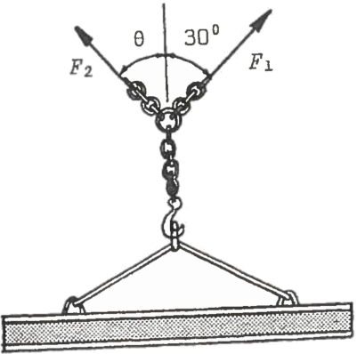

# Statics calculations

##### statics_min_angle_force.py
A homework I had to do, was to calculate the minimum force for F2, with range of angles from 0&deg; to 90&deg;.

The beam implies a force of 6kN downwards in -Y direction.

Simplified and doing all the required magic vector calculations, we get a formula of

